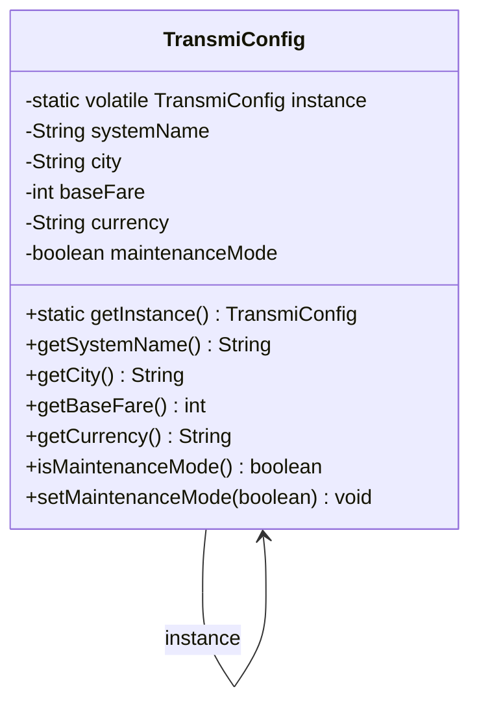
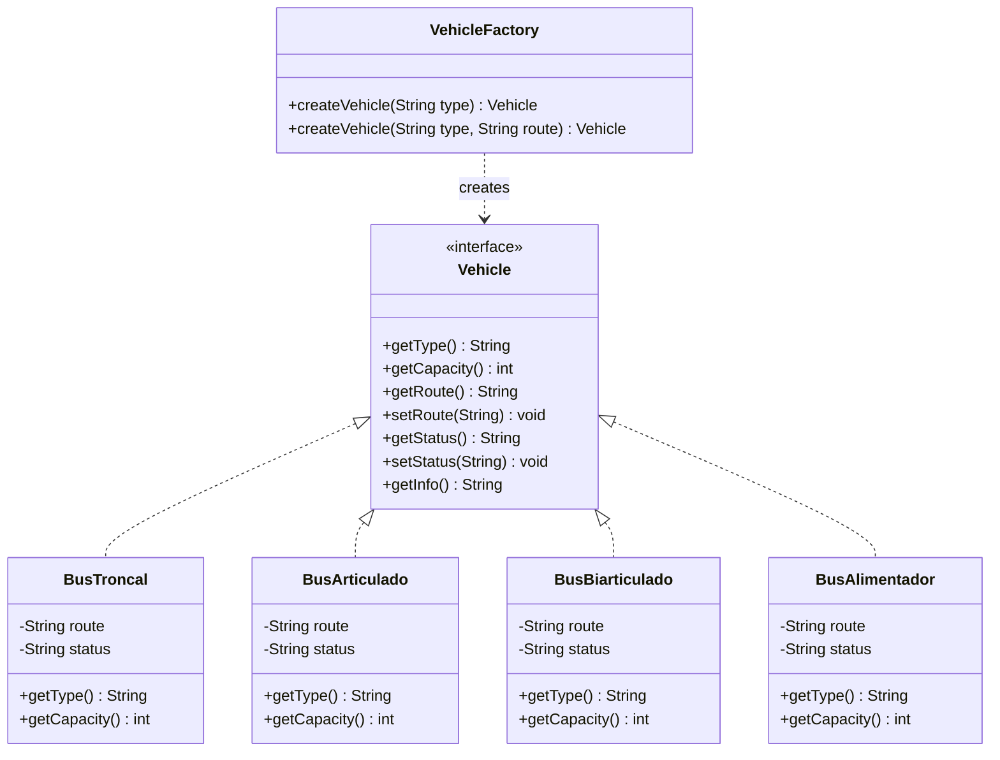
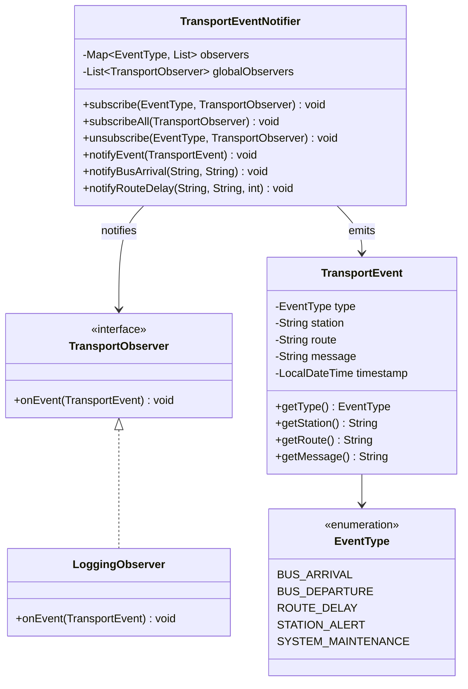
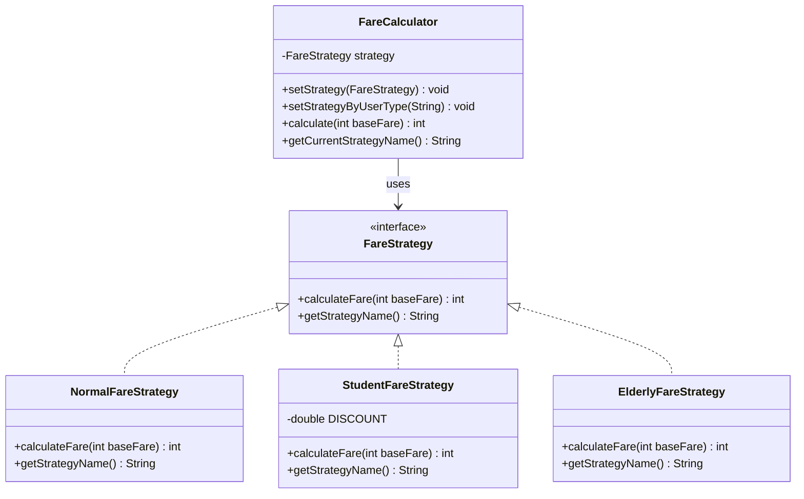
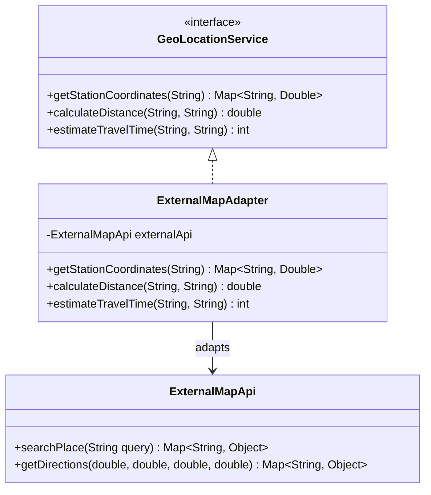
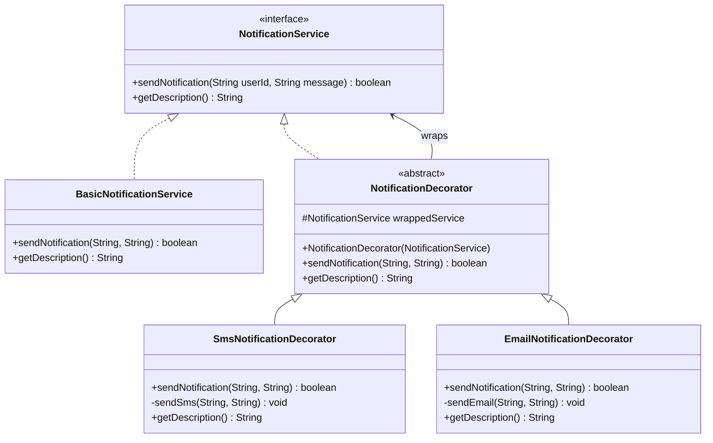
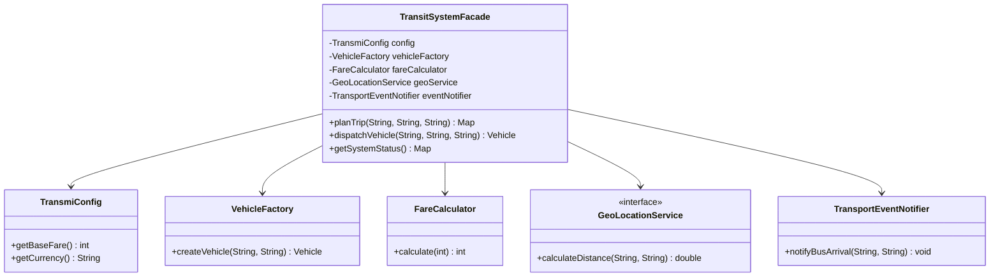
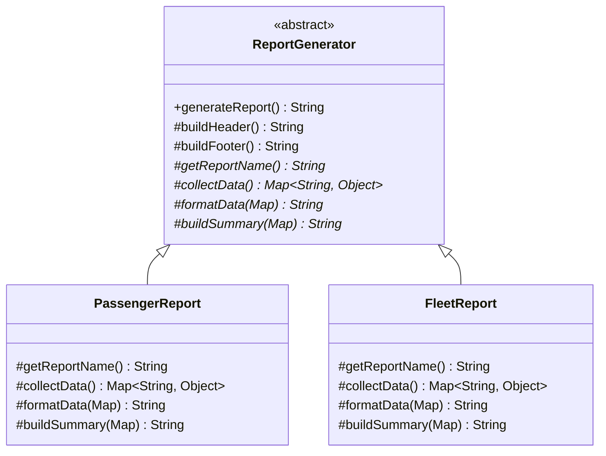
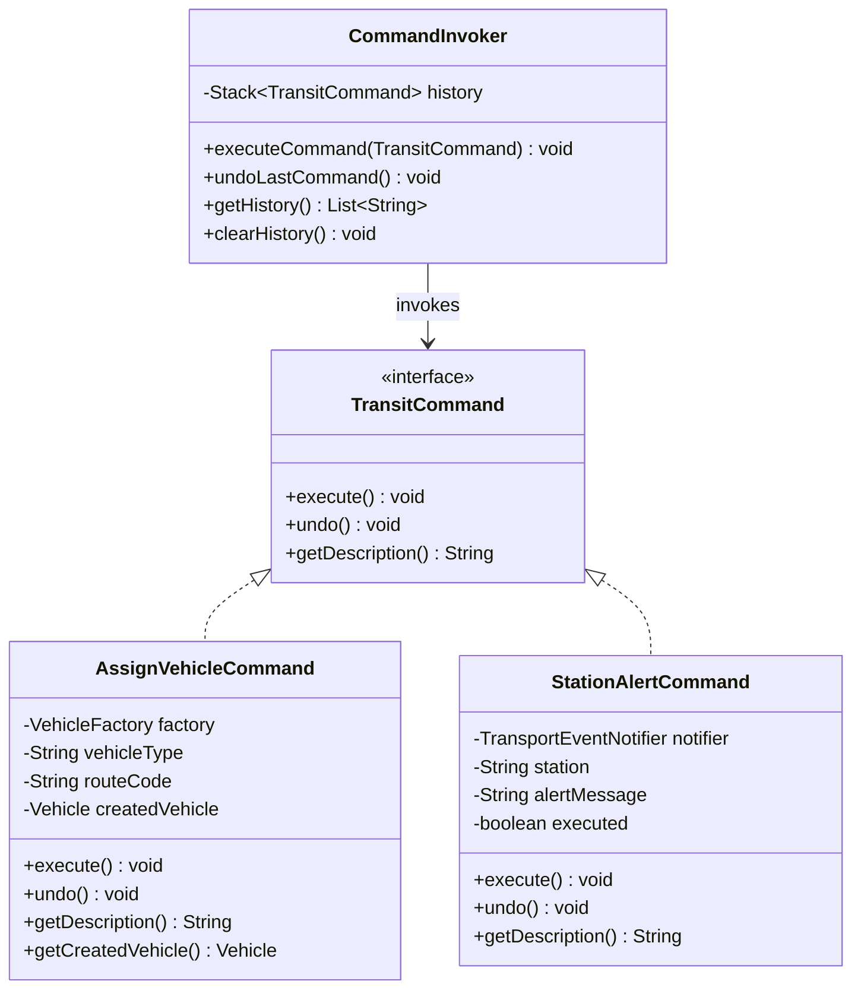

# Patrones de Diseño — TransmiApp Backend

Documentación de los **10 patrones de diseño** implementados en el backend de TransmiApp, aplicados al dominio del sistema de transporte masivo TransMilenio de Bogotá.

---

## Índice

1. [Singleton — TransmiConfig](#1-singleton--transmiconfig)
2. [Factory Method — VehicleFactory](#2-factory-method--vehiclefactory)
3. [Builder — Route.RouteBuilder](#3-builder--routeroutebuilder)
4. [Observer — TransportEventNotifier](#4-observer--transporteventnotifier)
5. [Strategy — FareCalculator](#5-strategy--farecalculator)
6. [Adapter — ExternalMapAdapter](#6-adapter--externalmapadapter)
7. [Decorator — NotificationService](#7-decorator--notificationservice)
8. [Facade — TransitSystemFacade](#8-facade--transitsystemfacade)
9. [Template Method — ReportGenerator](#9-template-method--reportgenerator)
10. [Command — TransitCommand](#10-command--transitcommand)

---

## 1. Singleton — TransmiConfig

**Propósito:** Garantiza que exista una única instancia de la configuración centralizada del sistema TransMilenio durante todo el ciclo de vida de la aplicación.

**Aplicación:** `TransmiConfig` almacena el nombre del sistema, la ciudad, la tarifa base y la moneda. Se utiliza double-checked locking como demostración del patrón puro, complementado con el scope singleton de Spring.



---

## 2. Factory Method — VehicleFactory

**Propósito:** Define una interfaz para crear objetos de tipo vehículo, permitiendo que las subclases decidan qué tipo de vehículo instanciar sin que el cliente conozca la clase concreta.

**Aplicación:** `VehicleFactory` crea instancias de `BusTroncal`, `BusArticulado`, `BusBiarticulado` o `BusAlimentador` según el tipo solicitado.



---

## 3. Builder — Route.RouteBuilder

**Propósito:** Separa la construcción de un objeto complejo de su representación, permitiendo que el mismo proceso de construcción cree diferentes representaciones.

**Aplicación:** `Route.RouteBuilder` permite construir rutas de TransMilenio paso a paso, definiendo estaciones, horarios, frecuencia y tipo de vehículo con una API fluida.

```mermaid
classDiagram
    class Route {
        -String code
        -String name
        -String origin
        -String destination
        -List~String~ stations
        -String scheduleStart
        -String scheduleEnd
        -int frequencyMinutes
        -String vehicleType
        -boolean isExpress
        +getCode() String
        +getName() String
        +getStations() List~String~
        +isExpress() boolean
    }

    class RouteBuilder {
        -String code
        -String name
        -String origin
        -String destination
        -List~String~ stations
        -String scheduleStart
        -String scheduleEnd
        -int frequencyMinutes
        -String vehicleType
        -boolean isExpress
        +RouteBuilder(String code, String name)
        +origin(String) RouteBuilder
        +destination(String) RouteBuilder
        +addStation(String) RouteBuilder
        +schedule(String, String) RouteBuilder
        +frequency(int) RouteBuilder
        +vehicleType(String) RouteBuilder
        +express(boolean) RouteBuilder
        +build() Route
    }

    Route +-- RouteBuilder
    RouteBuilder ..> Route : builds
```

---

## 4. Observer — TransportEventNotifier

**Propósito:** Define una dependencia uno-a-muchos entre objetos, de modo que cuando un objeto cambia de estado, todos sus dependientes son notificados automáticamente.

**Aplicación:** `TransportEventNotifier` emite eventos del sistema (llegada de buses, retrasos, alertas) y notifica a todos los observadores suscritos. Soporta suscripción por tipo de evento y suscripción global.



---

## 5. Strategy — FareCalculator

**Propósito:** Define una familia de algoritmos, encapsula cada uno de ellos y los hace intercambiables. Permite que el algoritmo varíe independientemente de los clientes que lo usan.

**Aplicación:** `FareCalculator` cambia dinámicamente la estrategia de cálculo de tarifa según el tipo de usuario: normal (100%), estudiante (40% descuento) o adulto mayor (gratuito).



---

## 6. Adapter — ExternalMapAdapter

**Propósito:** Convierte la interfaz de una clase en otra interfaz que los clientes esperan. Permite que clases con interfaces incompatibles trabajen juntas.

**Aplicación:** `ExternalMapAdapter` traduce la interfaz del API externo de mapas (`ExternalMapApi`) a la interfaz interna `GeoLocationService`, convirtiendo unidades (metros→km, segundos→minutos) y formatos de datos.



---

## 7. Decorator — NotificationService

**Propósito:** Añade responsabilidades adicionales a un objeto de forma dinámica. Proporciona una alternativa flexible a la herencia para extender funcionalidad.

**Aplicación:** Se puede componer un servicio de notificaciones que envíe por Push + SMS + Email apilando decoradores sobre el servicio base `BasicNotificationService`.



---

## 8. Facade — TransitSystemFacade

**Propósito:** Proporciona una interfaz unificada y simplificada para un conjunto de subsistemas, facilitando su uso.

**Aplicación:** `TransitSystemFacade` ofrece métodos de alto nivel como `planTrip()` y `dispatchVehicle()` que internamente coordinan la fábrica de vehículos, el calculador de tarifas, el servicio de geolocalización y el notificador de eventos.



---

## 9. Template Method — ReportGenerator

**Propósito:** Define el esqueleto de un algoritmo en una operación, delegando algunos pasos a las subclases sin cambiar la estructura general del algoritmo.

**Aplicación:** `ReportGenerator` define el flujo fijo de generación de reportes (header → datos → resumen → footer). Las subclases `PassengerReport` y `FleetReport` implementan los pasos concretos de recolección y formato de datos.



---

## 10. Command — TransitCommand

**Propósito:** Encapsula una solicitud como un objeto, permitiendo parametrizar clientes con diferentes solicitudes, encolar o registrar solicitudes, y soportar operaciones de deshacer.

**Aplicación:** `CommandInvoker` ejecuta y registra comandos como `AssignVehicleCommand` (asignar vehículo a ruta) y `StationAlertCommand` (activar alerta en estación). Soporta deshacer la última operación.



---

## Resumen de Endpoints

| # | Patrón | Endpoint | Método |
|---|--------|----------|--------|
| 1 | Singleton | `/api/transmi/config` | GET |
| 2 | Factory Method | `/api/transmi/vehicles?type=ARTICULADO` | POST |
| 3 | Builder | `/api/transmi/routes?code=B23&name=Calle80&origin=Portal80&destination=PortalNorte` | POST |
| 4 | Observer | `/api/transmi/events/arrival?station=PortalNorte&route=B23` | POST |
| 5 | Strategy | `/api/transmi/fare?userType=ESTUDIANTE` | GET |
| 6 | Adapter | `/api/transmi/geo/distance?origin=Calle80&destination=PortalNorte` | GET |
| 7 | Decorator | `/api/transmi/notifications?userId=123&message=Hola&sms=true&email=true` | POST |
| 8 | Facade | `/api/transmi/trip?origin=Calle80&destination=PortalNorte&userType=ESTUDIANTE` | GET |
| 9 | Template Method | `/api/transmi/reports/pasajeros` | GET |
| 10 | Command | `/api/transmi/commands/assign-vehicle?vehicleType=ARTICULADO&routeCode=B23` | POST |

**Ver listado completo:** `GET /api/transmi/patterns`
